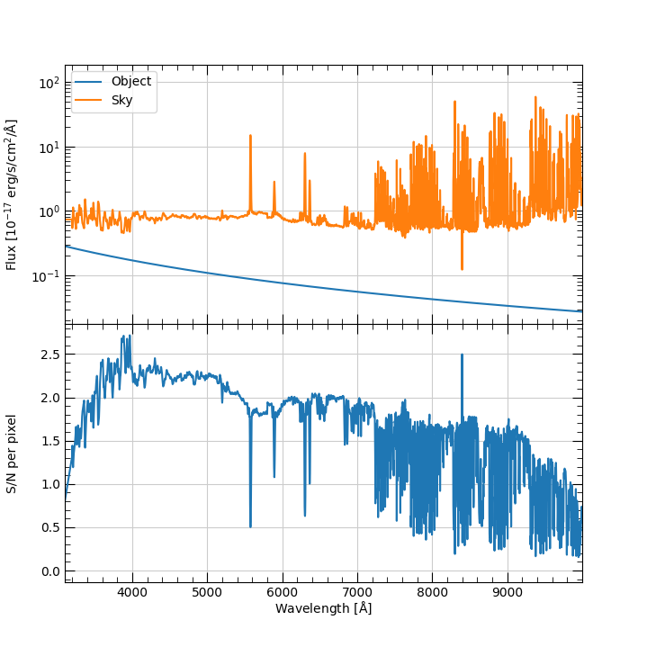

Keck-FOBOS Exposure Time Calculator
===================================

To run the Keck-FOBOS exposure-time calculator:

.. include:: help/fobos_etc.rst

Source spectrum
+++++++++++++++

The possible source spectra are:

    #. A featureless spectrum with a constant AB magnitude: This is
       the default spectrum, and the magnitude is set by the ``-m``
       command-line options.

    #. A spectrum read from a file: You can provide a spectrum
       directly using either a fits or columnated ascii text file.
       See the ``--spec_*`` command-line options. To check that the
       spectrum will be read correctly, see
       :func:`synospec.etc.spectrum.Spectrum.from_ascii` or
       :func:`synospec.etc.spectrum.Spectrum.from_fits`. E.g.::

            from synospec.etc.spectrum import Spectrum
            spec = Spectrum.from_ascii('spec.db.gz', wavecol=0, waveunits='nm', fluxcol=1,
                                       fluxunits = 'erg/s/cm2/angstrom', resolution=3e5,
                                       use_sampling_assessments=True)
            spec.plot(show=True)

    #. Emission-line spectrum. **This functionality is currently in
       development.**

Note that the code *always* rescales the spectrum to the provided
magnitude, which defaults to an AB mag of 24 in the g band. To
rescale to a different magnitude, in a different band or in a
different magnitude system (AB or Vega) use the ``--mag*``
command-line arguments. You can also redshift the provided spectrum
using the ``-z`` command-line option, but this hasn't been well
tested.

Sky Spectrum
++++++++++++

The sky spectrum defaults to
:class:`synospec.etc.spectrum.MaunakeaSkySpectrum`, which is an empirical
dark night-sky spectrum provided by Chuck Steidel.

.. warning::

    Efforts are ongoing to improve the inclusion of the sky spectrum.

        - The current script does not change the resolution of the
          sky spectrum!
        - The sky flux between 0.31-0.32 :math:`\mu{\rm m}` is just a
          constant added to match the level of the continuum between
          0.321-0.4 :math:`\mu{\rm m}`.

You can adjust the magnitude of the sky spectrum using the
``--sky_mag*`` command-line options; however, this is a simple
scaling of the dark-sky spectrum and will not be a true
representation of the sky spectrum under brighter moon conditions.

Source Surface-Brightness Distribution
++++++++++++++++++++++++++++++++++++++

The source can be:

    #. An unresolved point source (default)

    #. A source that fills the focal-plane aperture with a constant
       surface brightness; see ``--uniform``.

    #. Follow a Sersic profile; see ``--sersic``. This should be
       provided with the expected intrinsic parameters (i.e., before
       convolution with the seeing).

The source profile is convolved with a Gaussian seeing distribution
with a full-width at half maximum (FWHM) set by the ``--fwhm``
argument.

Note that when the source is selected to be a uniform surface
brightness within the focal-plane aperture, the provided magnitude of
the source is taken to be the surface brightness. In the other
distribution cases (point, Sersic), the magnitude is taken to be the
*total* magnitude.

Source Extraction
+++++++++++++++++

The ETC uses a nominal box extraction for the S/N calculation. This is primarily
used to calculate the aperture loss and the number of pixel read-noise hits to
include. By default the extraction aperture is set to the FWHM of the
monochromatic spot of the fiber image on the detector (see ``--spot_fwhm``).

Observing Specifications
++++++++++++++++++++++++

You can change the exposure time (``--time``), airmass
(``--airmass``), and seeing (``--fwhm``) conditions for the
observation; defaults are 1 hr, 1.0, and 0.65 arcsec, respectively.

S/N calculation
+++++++++++++++

The main output of the ETC is a plot of the S/N as a function of
wavelength. An example looks like this:

   Output from simply executing ``fobos_etc`` with no command-line
   arguments. The object and sky spectra are shown in the top panel.
   The S/N per pixel is shown in the bottom panel.

You can change the error incurred from the sky subtraction
(``--sky_err``) and the units for the S/N vector (``--snr_units``).

By default, the plot will not be produced, and the code will simply provide some
text to the terminal giving the mean S/N in different broad-band windows.  To
turn the plot on, set ``--plot``.  To drop into an ipython session at the end of
the script, use ``--ipython``.

