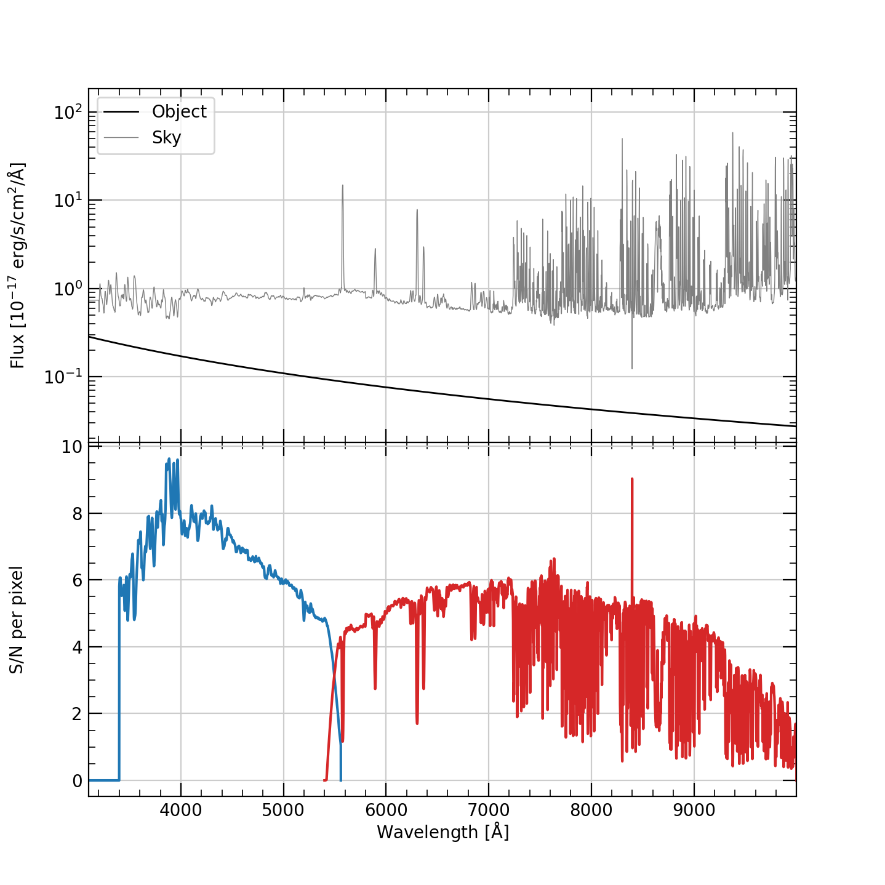

Scripts
=======

WFOS
----

To run the TMT-WFOS exposure-time calculator:

.. code-block:: console

    % wfos_etc -h
    usage: wfos_etc [-h] [--spec_file SPEC_FILE] [--spec_wave SPEC_WAVE]
                    [--spec_wave_units SPEC_WAVE_UNITS] [--spec_flux SPEC_FLUX]
                    [--spec_flux_units SPEC_FLUX_UNITS]
                    [--spec_res_indx SPEC_RES_INDX | --spec_res_value SPEC_RES_VALUE]
                    [--spec_table SPEC_TABLE] [-l EMLINE] [-m MAG]
                    [--mag_band MAG_BAND] [--mag_system MAG_SYSTEM]
                    [--sky_mag SKY_MAG] [--sky_mag_band SKY_MAG_BAND]
                    [--sky_mag_system SKY_MAG_SYSTEM] [-z REDSHIFT]
                    [-s SERSIC SERSIC SERSIC SERSIC | -u] [--blue_grat BLUE_GRAT]
                    [--blue_wave BLUE_WAVE | --blue_angle BLUE_ANGLE]
                    [--blue_binning BLUE_BINNING BLUE_BINNING]
                    [--red_grat RED_GRAT]
                    [--red_wave RED_WAVE | --red_angle RED_ANGLE]
                    [--red_binning RED_BINNING RED_BINNING]
                    [--slit SLIT SLIT SLIT SLIT SLIT] [--extract EXTRACT]
                    [-t TIME] [-f FWHM] [-a AIRMASS] [-i] [-p]
                    [--snr_units SNR_UNITS] [--sky_err SKY_ERR]

    WFOS Exposure Time Calculator (v0.1)

    optional arguments:
      -h, --help            show this help message and exit
      --spec_file SPEC_FILE
                            A fits or ascii file with the object spectrum to use
                            (default: None)
      --spec_wave SPEC_WAVE
                            Extension or column number with the wavelengths.
                            (default: WAVE)
      --spec_wave_units SPEC_WAVE_UNITS
                            Wavelength units (default: angstrom)
      --spec_flux SPEC_FLUX
                            Extension or column number with the flux. (default:
                            FLUX)
      --spec_flux_units SPEC_FLUX_UNITS
                            Input units of the flux density. Must be interpretable
                            by astropy.units.Unit. Code assumes 1e-17 erg / (cm2 s
                            angstrom) if units are not provided. (default: None)
      --spec_res_indx SPEC_RES_INDX
                            Extension or column number with the flux. (default:
                            None)
      --spec_res_value SPEC_RES_VALUE
                            Single value for the spectral resolution (R =
                            lambda/dlambda) for the full spectrum. (default: None)
      --spec_table SPEC_TABLE
                            Extension in the fits file with the binary table data.
                            (default: None)
      -l EMLINE, --emline EMLINE
                            File with emission lines to add to the spectrum.
                            (default: None)
      -m MAG, --mag MAG     Total apparent magnitude of the source (default: 24.0)
      --mag_band MAG_BAND   Broad-band used for the provided magnitude. Must be u,
                            g, r, i, or z. (default: g)
      --mag_system MAG_SYSTEM
                            Magnitude system. Must be either AB or Vega. (default:
                            AB)
      --sky_mag SKY_MAG     Surface brightness of the sky in mag/arcsec^2 in the
                            defined broadband. If not provided, default dark-sky
                            spectrum is used. (default: None)
      --sky_mag_band SKY_MAG_BAND
                            Broad-band used for the provided sky surface
                            brightness. Must be u, g, r, i, or z. (default: g)
      --sky_mag_system SKY_MAG_SYSTEM
                            Magnitude system. Must be either AB or Vega. (default:
                            AB)
      -z REDSHIFT, --redshift REDSHIFT
                            Redshift of the object, z (default: 0.0)
      -s SERSIC SERSIC SERSIC SERSIC, --sersic SERSIC SERSIC SERSIC SERSIC
                            Use a Sersic profile to describe the object surface-
                            brightness distribution; order must be effective
                            radius, Sersic index, ellipticity (1-b/a), position
                            angle (deg). (default: None)
      -u, --uniform         Instead of a point source or Sersic profile, assume
                            the surface brightness distribution is uniform over
                            the fiber face. If set, the provided magnitude is
                            assumed to be a surface brightness. See the MAG
                            option. (default: False)
      --blue_grat BLUE_GRAT
                            Grating to use in the blue arm. Options are: B1210,
                            B2479, B2700, B3600 (default: B1210)
      --blue_wave BLUE_WAVE
                            Central wavelength for the blue arm. If None, will use
                            the peak-efficiency wavelength. (default: None)
      --blue_angle BLUE_ANGLE
                            Grating angle for blue grating. If None, will use then
                            angle the provides the best efficiency for the on-axis
                            spectrum. (default: None)
      --blue_binning BLUE_BINNING BLUE_BINNING
                            On-chip binning for the blue grating. Order is
                            spectral then spatial. I.e., to bin 2 pixels
                            spectrally and no binning spatial, set --blue_binning
                            2 1 (default: [1, 1])
      --red_grat RED_GRAT   Grating to use in the red arm. Options are: R680,
                            R1392, R1520, R2052 (default: R680)
      --red_wave RED_WAVE   Central wavelength for the red arm. If None, will use
                            the peak-efficiency wavelength. (default: None)
      --red_angle RED_ANGLE
                            Grating angle for red grating. If None, will use then
                            angle the provides the best efficiency for the on-axis
                            spectrum. (default: None)
      --red_binning RED_BINNING RED_BINNING
                            On-chip binning for the red grating. Order is spectral
                            then spatial. I.e., to bin 2 pixels spectrally and no
                            binning spatial, set --red_binning 2 1 (default: [1,
                            1])
      --slit SLIT SLIT SLIT SLIT SLIT
                            Slit properties: x field center, y field center,
                            width, length, rotation. The rotation is in degrees,
                            everything else is in on-sky arcsec. The slit width is
                            in the *unrotated* frame, meaning the effective slit
                            width for a rotated slit is slit_width/cos(rotation).
                            For the field center, x is along the dispersion
                            direction with a valid range of +/- 90 arcsec, and y
                            is in the cross-dispersion direction with a valid
                            range of +/- 249 arcsec. Coordinate (0,0) is on axis.
                            (default: [0.0, 0.0, 0.75, 5.0, 0.0])
      --extract EXTRACT     Extraction aperture in arcsec *along the slit*
                            centered on the source. At the detector, the
                            extraction aperture is narrower by cos(slit rotation).
                            If not provided, set to the FWHM of the seeing disk;
                            see --fwhm (default: None)
      -t TIME, --time TIME  Exposure time (s) (default: 3600.0)
      -f FWHM, --fwhm FWHM  On-sky PSF FWHM (arcsec) (default: 0.65)
      -a AIRMASS, --airmass AIRMASS
                            Airmass (default: 1.0)
      -i, --ipython         After completing the setup, embed in an IPython
                            session. (default: False)
      -p, --plot            Provide a plot of the components of the calculation.
                            (default: False)
      --snr_units SNR_UNITS
                            The units for the S/N. Options are pixel, angstrom,
                            resolution. (default: pixel)
      --sky_err SKY_ERR     The fraction of the Poisson error in the sky incurred
                            when subtracting the sky from the observation. Set to
                            0 for a sky subtraction that adds no error to the sky-
                            subtracted spectrum; set to 1 for a sky-subtraction
                            error that is the same as the Poisson error in the sky
                            spectrum acquired during the observation. (default:
                            0.1)

Source spectrum
+++++++++++++++

The possible source spectra are:

    #. A featureless spectrum with a constant AB magnitude: This is
       the default spectrum, and the magnitude is set by the ``-m``
       command-line options.

    #. A spectrum read from a file: You can provide a spectrum
       directly using either a fits or columnated ascii text file.
       See the ``--spec_*`` command-line options. To check that the
       spectrum will be read correctly, see
       :func:`synospec.etc.spectrum.Spectrum.from_ascii` or
       :func:`synospec.etc.spectrum.Spectrum.from_fits`. E.g.::

            from synospec.etc.spectrum import Spectrum
            spec = Spectrum.from_ascii('spec.db.gz', wavecol=0, waveunits='nm', fluxcol=1,
                                       fluxunits = 'erg/s/cm2/angstrom', resolution=3e5,
                                       use_sampling_assessments=True)
            spec.plot(show=True)

    #. Emission-line spectrum. **This functionality is currently in
       development.**

Note that the code *always* rescales the spectrum to the provided
magnitude, which defaults to an AB mag of 24 in the g band. To
rescale to a different magnitude, in a different band or in a
different magnitude system (AB or Vega) use the ``--mag*``
command-line arguments. You can also redshift the provided spectrum
using the ``-z`` command-line option, but this hasn't been well
tested.

Sky Spectrum
++++++++++++

The sky spectrum defaults to
:class:`synospec.etc.spectrum.MaunakeaSkySpectrum`, which is an empirical
dark night-sky spectrum provided by Chuck Steidel.

.. warning::

    Efforts are ongoing to improve the inclusion of the sky spectrum.

        - The current script does not change the resolution of the
          sky spectrum!
        - The sky flux between 0.31-0.32 :math:`\mu{\rm m}` is just a
          constant added to match the level of the continuum between
          0.321-0.4 :math:`\mu{\rm m}`.

You can adjust the magnitude of the sky spectrum using the
``--sky_mag*`` command-line options; however, this is a simple
scaling of the dark-sky spectrum and will not be a true
representation of the sky spectrum under brighter moon conditions.

Source Surface-Brightness Distribution
++++++++++++++++++++++++++++++++++++++

The source can be:

    #. An unresolved point source (default)

    #. A source that fills the focal-plane aperture with a constant
       surface brightness; see ``--uniform``.

    #. Follow a Sersic profile; see ``--sersic``. This should be
       provided with the expected intrinsic parameters (i.e., before
       convolution with the seeing).

The source profile is convolved with a Gaussian seeing distribution
with a full-width at half maximum (FWHM) set by the ``--fwhm``
argument.

Note that when the source is selected to be a uniform surface
brightness within the focal-plane aperture, the provided magnitude of
the source is taken to be the surface brightness. In the other
distribution cases (point, Sersic), the magnitude is taken to be the
*total* magnitude.

Instrument Setup
++++++++++++++++

The WFOS instrument settings for its blue and red arms are set by the
``--blue_*`` and ``--red_*`` command-line options. The default
gratings are for the low-resolution mode. If the grating angle or
central wavelength are not provided, they are set to maximize grating
efficiency. The available gratings for the blue arm and some useful
properties for a 1 arcsec slit are:

+-------+----------------------+---------------+-----------------------+-------------------------------+
| Name  | Peak :math:`\lambda` | Grating Angle | :math:`\Delta\lambda` | Resolution                    |
|       | (angstrom)           | (deg)         | (angstrom)            | :math:`\lambda/\Delta\lambda` |
+=======+======================+===============+=======================+===============================+
| B1210 |               3933.3 |          13.8 |                   3.9 |                          1011 |
+-------+----------------------+---------------+-----------------------+-------------------------------+
| B2479 |               4076.0 |          30.3 |                   1.7 |                          2415 |
+-------+----------------------+---------------+-----------------------+-------------------------------+
| B2700 |               4944.3 |          41.9 |                   1.3 |                          3697 |
+-------+----------------------+---------------+-----------------------+-------------------------------+
| B3600 |               3735.6 |          42.3 |                   1.0 |                          3747 |
+-------+----------------------+---------------+-----------------------+-------------------------------+

The available gratings for the red arm and some useful
properties for a 1 arcsec slit are:

+-------+----------------------+---------------+-----------------------+-------------------------------+
| Name  | Peak :math:`\lambda` | Grating Angle | :math:`\Delta\lambda` | Resolution                    |
|       | (angstrom)           | (deg)         | (angstrom)            | :math:`\lambda/\Delta\lambda` |
+=======+======================+===============+=======================+===============================+
|  R680 |               7352.4 |          14.5 |                   6.9 |                          1065 |
+-------+----------------------+---------------+-----------------------+-------------------------------+
| R1392 |               7200.4 |          30.1 |                   3.0 |                          2389 |
+-------+----------------------+---------------+-----------------------+-------------------------------+
| R1520 |               8839.6 |          42.2 |                   2.4 |                          3741 |
+-------+----------------------+---------------+-----------------------+-------------------------------+
| R2052 |               6569.6 |          42.4 |                   1.7 |                          3764 |
+-------+----------------------+---------------+-----------------------+-------------------------------+

The quantities in these tables (and for other grating settings) can
be generated as follows (see :class:`~synospec.etc.spectrographs.SlitSpectrographArm`):

.. code-block:: python

    from synospec.etc.spectrographs import WFOSGrating, TMTWFOSBlue, TMTWFOSRed

    blue_gratings = [g for g in WFOSGrating.available_gratings.keys() if 'B' in g]
    for grating in blue_gratings:
        arm = TMTWFOSBlue(grating=grating)
        print('{0:>5} {1:5.1f} {2:4.1f} {3:5.1f} {4:5.0f}'.format(
                grating, arm.cen_wave, arm.grating_angle,
                arm.resolution_element(slit_width=1., units='angstrom', wave=arm.cen_wave),
                arm.resolution(arm.cen_wave, slit_width=1.)))

    red_gratings = [g for g in WFOSGrating.available_gratings.keys() if 'R' in g]
    for grating in red_gratings:
        arm = TMTWFOSRed(grating=grating)
        print('{0:>5} {1:5.1f} {2:4.1f} {3:5.1f} {4:5.0f}'.format(
                grating, arm.cen_wave, arm.grating_angle,
                arm.resolution_element(slit_width=1., units='angstrom', wave=arm.cen_wave),
                arm.resolution(arm.cen_wave, slit_width=1.)))

The number of pixels per resolution element for a 1 arcsec slit is 19.4, e.g.:

.. code-block:: python

    from synospec.etc.spectrographs import TMTWFOSBlue
    print(TMTWFOSBlue().resolution_element(slit_width=1., units='pixels'))

You can change the detector binning using the ``--*_binning``
command-line arguments.

Slit Properties
+++++++++++++++

To set the slit position and shape, use the ``--slit`` command-line
option. The field position leads to some changes in the available
spectral range --- driven by the "y" (cross-dispersed) position ---
and efficiency --- driven by the change in grating incidence angle.

For different slit widths, you can appropriately scale
:math:`\Delta\lambda` and :math:`R` to get the expected performance.
For example, the spectral resolution for a 0.75 arcsec slit for the
B1210 setup shown above is 1011/0.75 = 1348. In the same way, the
slit width also changes the number of detector pixels per resolution
element (19.4*0.75 = 14.5 pixels for a 0.75 arcsec slit), which may
affect your binning choice.

You can change the rotation of the slit relative to the dispersion
axis, but beware of follow-on changes to the S/N calculation.
Specifically, this changes the effective slit width along the
dispersion direction by :math:`1/\cos({\rm rotation}`. Given the
definition of the extraction aperture as always *along* the slit,
this also changes the number of pixels in the extraction.

Source Extraction
+++++++++++++++++

The ETC uses a nominal box extraction for the S/N calculation. This
primarily used to calculate the aperture loss and the number of pixel
read-noise hits to include. By default the extraction aperture is set
to the seeing FWHM. To change the extraction width, use the
``--extract`` command-line argument; note that the extraction width
is always *along* the slit length, centered on the object.

Observing Specifications
++++++++++++++++++++++++

You can change the exposure time (``--time``), airmass
(``--airmass``), and seeing (``--fwhm``) conditions for the
observation; defaults are 1 hr, 1.0, and 0.65 arcsec, respectively.

S/N calculation
+++++++++++++++

The main output of the ETC is a plot of the S/N as a function of
wavelength. An example looks like this:

   Output from simply executing ``wfos_etc`` with no command-line
   arguments. The object and sky spectra are shown in the top panel.
   The S/N per pixel is shown in the bottom panel for the blue arm in
   blue and the red arm in red.

You can change the error incurred from the sky subtraction
(``--sky_err``) and the units for the S/N vector (``--snr_units``).

To turn the plot off, set ``--plot``. To drop into an ipython session
at the end of the script, use ``--ipython``.
